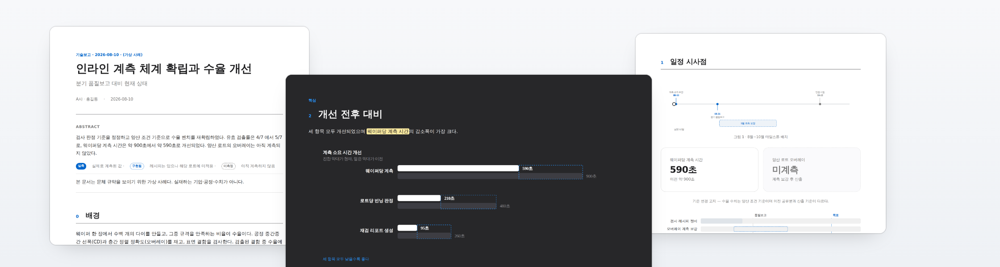
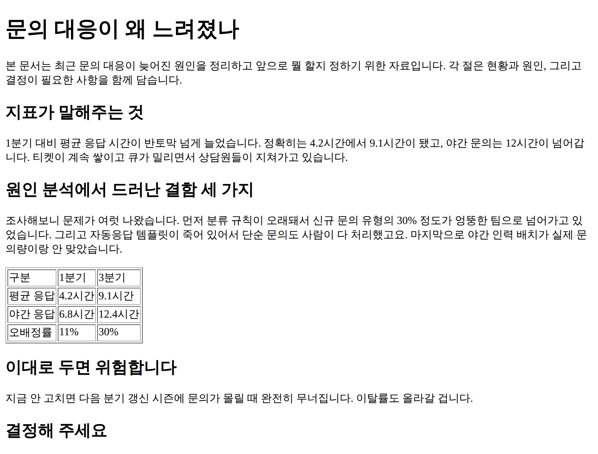
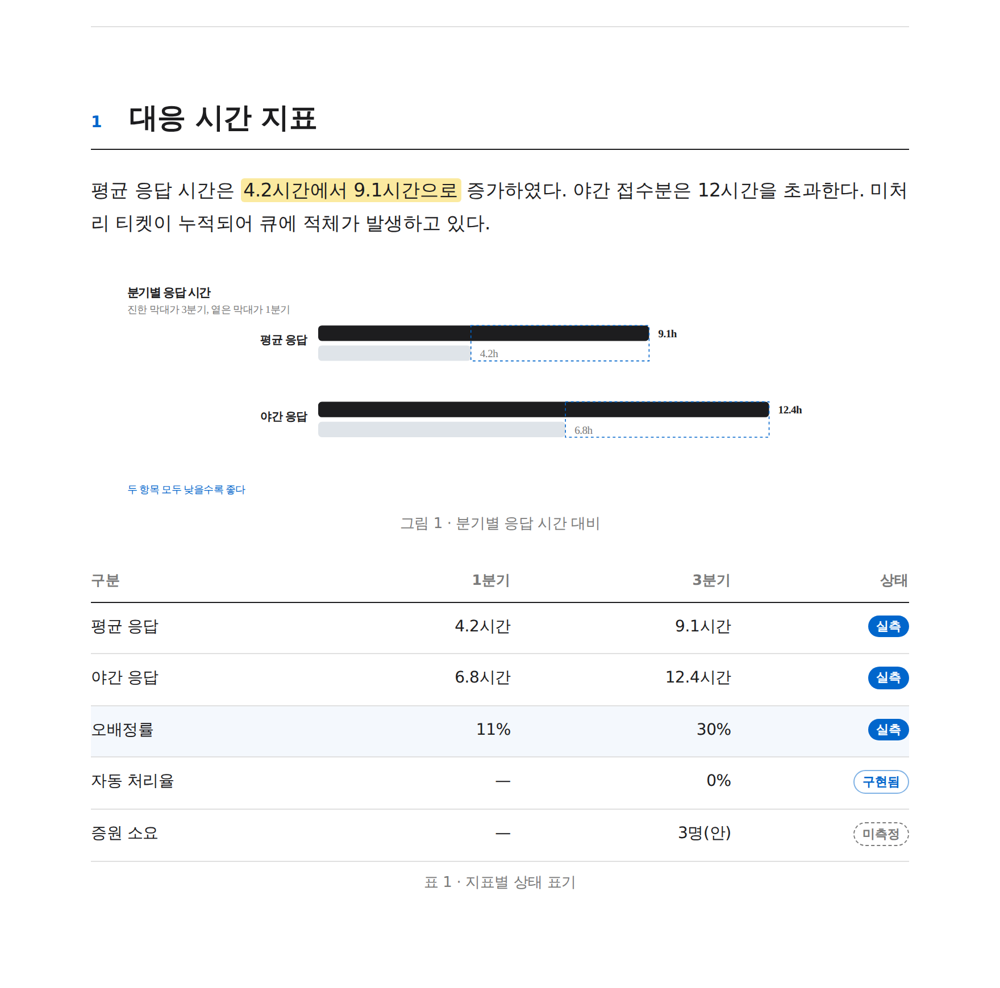

 <b>korean-report-skills</b>

[](../../actions)
[](../../releases)
[](INSTALL.md)
[](LICENSE)

# Claude가 쓴 글이 어딘가 이상할 때 <!-- style-exempt -->

내용은 맞아도 번역체, 모호한 수치, 들쭉날쭉한 페이지 배치가 남으면 문서는 아직
초안처럼 보입니다.

`korean-report-style`은 문체와 근거를 다듬고, `korean-report-doc`은 그 내용을
일관된 `layout`으로 구성합니다. 이어서 HTML `typesetting`과 렌더 검사를 수행하고,
필요하면 PDF와 검수용 스크린샷까지 만듭니다.

여기서 `layout`은 페이지와 요소의 배치를, `typesetting`은 CSS·글꼴·수식을 반영해
최종 HTML을 만드는 처리 단계를 뜻합니다.

글만 다듬을 때는 `korean-report-style`을 사용합니다. HTML이나 PDF까지 필요할 때는
`korean-report-doc`을 함께 사용합니다. Claude Code, Codex, Cursor, OpenCode에서
사용할 수 있습니다.

<picture>
  <source media="(prefers-color-scheme: dark)" srcset="docs/assets/banner-dark.png">
  
</picture>

## 두 스킬의 역할

| 스킬 | 맡는 일 | 결과 |
|---|---|---|
| `korean-report-style` | 문체, 프레이밍, 용어, 상태·근거 표기, 편집 후 정합성 검토 | 수정 원고와 lint 결과 |
| `korean-report-doc` | 문서 구조, `paper`·`deck` 모드의 `layout`, 도해, 수식, HTML `typesetting`, 렌더 QA | 자립형 HTML과 선택적 PDF |

문체 스킬은 어미만 바꾸는 교정기가 아닙니다. 실측과 추정을 구분하고, 주장에 근거가
있는지 확인하며, 리스크와 대응이 함께 적혀 있는지도 살핍니다. 문서 스킬을 함께 쓰면
이 검토를 공통 디자인 시스템과 브라우저 렌더 검사까지 이어갑니다.

## 사용 예

설치한 뒤에는 평소처럼 작업을 요청하면 됩니다.

```text
지난주 벤치 결과로 기술보고서를 작성해 줘.
이 문단을 외부 협력사에 전달할 보고 문체로 수정해 줘.
이 진행현황에서 미측정 수치와 근거가 없는 주장을 표시해 줘.
회의에서 검토할 쟁점과 결정 요청을 가로형 협의자료로 만들어 줘.
```

스킬 이름을 직접 적을 필요는 없습니다. 명시적으로 선택하려면 Codex에서는
`$korean-report-doc`, Claude Code에서는 `/korean-report-doc`처럼 요청할 수 있습니다.

설명이나 요약만 요청하면 대화 안에서 답하고, 별도의 문서 파일은 만들지 않습니다.
HTML이나 PDF처럼 완성된 산출물을 요청하면 문서 제작 절차를 시작합니다.

## 결과물

문서의 목적에 따라 `paper`와 `deck` 중 하나를 선택합니다.

| 항목 | `paper` | `deck` |
|---|---|---|
| 잘 맞는 문서 | 기술보고, 벤치마크, 진행현황, 연구노트 | 회의자료, 아젠다, 협의자료, 의사결정 요청 |
| 방향 | 세로 | 가로 |
| 페이지 흐름 | 내용이 이어지는 연속 문서 | 한 섹션을 한 페이지에 배치 |

두 모드는 글자 크기와 페이지 구조, 인쇄 규칙이 다릅니다. 하나의 문서 안에서는
두 모드를 섞지 않습니다.

완성된 HTML은 CSS, 사용된 KaTeX CSS와 글꼴을 한 파일 안에 담습니다. 실행할 때
외부 자원을 요청하지 않으므로 네트워크가 없는 환경에서도 열고 인쇄할 수 있습니다.
PDF는 이 HTML을 자동화 브라우저로 인쇄해 만듭니다.

아래 이미지는 같은 가상 원고를 브라우저 기본 스타일로 저장한 HTML과 `paper` 모드로
`typesetting`한 결과를 나란히 보여줍니다.

<table>
<tr>
<th width="50%">브라우저 기본 스타일</th>
<th width="50%">paper 모드 적용</th>
</tr>
<tr>
<td></td>
<td></td>
</tr>
</table>

문체 규칙은 표현뿐 아니라 수치의 상태, 주장과 한계, 의사결정 요청의 근거에도
적용됩니다.



전후 원고와 규칙별 근거는 [examples/before_after.md](examples/before_after.md)에서 볼 수
있습니다. 예시에 등장하는 기업, 공정, 인물, 수치는 모두 가상입니다.

## 설치

| 환경 | 권장 설치 방식 | 설치 식별자 |
|---|---|---|
| Claude Code | GitHub `marketplace` 플러그인 | `korean-report@korean-report-skills` |
| Codex | GitHub `marketplace` 플러그인 | `korean-report@korean-report-skills` |
| OpenCode | npm 플러그인 | `korean-report-skills` |
| Cursor | npm 파일 복사 | `korean-report-skills` |

### Claude Code

```text
/plugin marketplace add JangHyun-bin/korean-report-skills
/plugin install korean-report@korean-report-skills
```

### Codex

```bash
codex plugin marketplace add JangHyun-bin/korean-report-skills
codex plugin add korean-report@korean-report-skills
```

### OpenCode

`opencode.json`의 `plugin` 배열에 npm 패키지를 등록합니다.

```json
{
  "$schema": "https://opencode.ai/config.json",
  "plugin": ["korean-report-skills"]
}
```

OpenCode를 다시 시작하면 package의 `config` hook이 두 스킬의 경로를 추가합니다.
이 방식에는 별도의 `npm i -g`나 `npx` 복사가 필요하지 않습니다.

### Cursor와 파일 복사 설치

`npx` 설치기는 Claude Code, Codex, Cursor의 스킬 디렉터리에 두 스킬을 복사합니다.
OpenCode의 npm 플러그인 등록과는 다른 설치 방식입니다.

```bash
npx korean-report-skills                 # Claude Code · Codex · Cursor
npx korean-report-skills cursor          # Cursor만 선택
npx korean-report-skills --project       # 현재 프로젝트에 설치
npx korean-report-skills --remove        # 복사한 스킬 제거
```

설치 후 새 세션을 시작하고 스킬 목록에서 `korean-report-doc`과
`korean-report-style`을 확인합니다. 갱신, 제거, 프로젝트 설치, claude.ai 업로드 절차는
[INSTALL.md](INSTALL.md)에 정리되어 있습니다.

## 문서 제작과 검수

문서 파일은 다음 순서로 만들어집니다.

```text
자료와 원고
  → Python 생성기와 문서 구조
  → 원시 HTML
  → Node와 KaTeX로 수식 렌더링, CSS 삽입, 자산 내장
  → 자립형 HTML
  → 브라우저 렌더 QA
  → 선택적 PDF와 검수용 스크린샷
```

### 문체 검사

`korean-report-style`의 lint는 Markdown과 HTML의 가시 텍스트를 검사합니다.
치환 목록 118건과 제목, 문맥 의존 표현, 어미 규칙을 네 갈래로 구분합니다.

| 갈래 | 의미 |
|---|---|
| 고침 | 검증된 어미 활용형이며 `--fix`로 수정 가능 |
| 검토 | 문맥을 확인한 뒤 선택해야 하는 표현 |
| 제목 | 명사구가 아닌 제목 |
| 의심 | `--heuristic`에서만 확인하는 문맥 의존 표현 |

검사 결과는 일반 텍스트뿐 아니라 JSON, GitHub annotation, SARIF로도 출력할 수 있습니다.
의미가 달라질 수 있는 용어나 문맥 의존 표현은 자동으로 수정하지 않습니다.

### 렌더 검사

HTML을 브라우저로 렌더한 뒤에는 다음 항목을 확인합니다.

- 수식 marker와 template token의 잔존 여부
- 문서와 표의 가로 넘침
- CSS token과 본문 글꼴 stack 적용
- SVG `viewBox` clipping과 캡션 누락
- `deck` section의 인쇄 페이지 초과

페이지 분할, 과도한 빈 공간, 제목의 고립, 다크 타일의 인쇄 반전처럼 수치만으로
판정하기 어려운 항목은 스크린샷과 PDF를 함께 확인합니다.

## 지원 범위와 현재 한계

문서 제작에는 진행현황, 중간보고, 기술보고, 연구노트, 벤치마크 보고, 협의자료,
회의 아젠다, 제안서가 포함됩니다. 문체 규칙은 코드베이스 인수인계, 아키텍처 문서,
runbook, API reference, 모델 평가, 회의록, 컨소시엄 산출물에도 적용할 수 있습니다.

현재 범위는 다음과 같습니다.

- 한국어 기술·사업 문서를 대상으로 합니다. 다른 언어의 문체와 `layout` 규칙은 아직
  포함하지 않습니다.
- 제공된 수치와 서술의 정합성은 검사하지만, 입력 자료에 없는 사실이나 근거를 새로
  확정하지 않습니다.
- 기준 결과물은 자립형 HTML이며, 필요하면 PDF를 함께 만듭니다. 네이티브 `.docx`와
  `.pptx` 파일은 생성하지 않습니다.
- 법률·규제 적합성이나 외부 사실의 정확성을 보증하지 않습니다. 기한, 의무, 책임이
  포함된 문장은 사용자가 제공한 근거 문서와 대조해야 합니다.

본문 글꼴은 사용 권한이 있는 WOFF2 파일을 `--font`로 지정한 경우에만 HTML에
내장됩니다. 글꼴을 지정하지 않아도 빌드는 완료되지만 시스템 글꼴을 사용하므로
기기마다 줄바꿈과 페이지 배치가 달라질 수 있습니다.

## 필요한 실행 환경

`korean-report-style`의 문체 규칙에는 추가 런타임 의존성이 없습니다.
`korean-report-doc`으로 HTML을 빌드하려면 Node 20 이상과 KaTeX가 필요합니다.
렌더 QA, 스크린샷, PDF 출력에는 Python 3.11 이상, Playwright, Chromium이 필요합니다.

```bash
npm install katex
python3 -m pip install playwright
python3 -m playwright install chromium
```

## 소스 저장소에서 직접 실행

이 절은 설치된 플러그인의 사용법이 아니라, 저장소에서 생성기와 빌드 도구를 직접
실행하려는 개발자를 위한 안내입니다.

저장소의 Node 의존성은 `npm install`로 설치합니다. 위의 Python 실행 환경을 준비한 뒤
다음 명령으로 문서 뼈대를 만들 수 있습니다.

```bash
npm install
python3 scripts/new-document.py --title "문서 제목" --mode paper
python3 문서_제목.py
```

생성된 Python 파일에서 본문, 표, 도해를 수정합니다. 본문 글꼴을 HTML에 내장하려면
실행할 때 WOFF2 경로를 지정합니다.

```bash
python3 문서_제목.py --font Pretendard-Regular.woff2 --font Pretendard-SemiBold.woff2
python3 scripts/qa.py 문서_제목.html --pdf --shot shots/
```

문체 검사와 저장소 회귀 검사는 다음 명령으로 실행할 수 있습니다.

```bash
python3 plugins/korean-report/skills/korean-report-style/assets/lint.py 초안.md
python3 plugins/korean-report/skills/korean-report-style/assets/lint.py 초안.md --fix
npm test
```

## 저장소 구조

```text
plugins/korean-report/
  skills/
    korean-report-doc/
      assets/                 template, CSS, figures.py, mathbuild.js, qa.py
      references/             design·figure 규칙
    korean-report-style/
      assets/lint.py          문체 검사기
      references/             치환 규칙·software handoff heuristic
.claude-plugin/               Claude Code·Codex marketplace 선언
.opencode/                    OpenCode npm plugin adapter
bin/install.js                Claude Code·Codex·Cursor file-copy 설치기
scripts/                      생성기, QA, 패키징, 이미지 생성
tests/                        정합성·회귀·end-to-end 검사
```

문체 규칙은 Markdown 표를 단일 원천으로 사용합니다. `base.css`에는 공통 디자인 token,
`paper.css`와 `deck.css`에는 모드별 규칙이 있습니다. 도해의 SVG class도 같은 token을
사용합니다.

새 문체 규칙과 문맥 heuristic은 현재 구조 안에서 추가할 수 있습니다. 새 출력 모드,
글꼴 정책, 언어 지원을 추가하려면 template, builder, QA, 회귀 검사를 함께 변경해야
합니다.

## 기여와 보안

기여 절차와 회귀 검사 기준은 [CONTRIBUTING.md](CONTRIBUTING.md)에 있습니다. 보안
취약점은 공개 issue 대신 [Security Advisory](../../security/advisories/new)로 신고합니다.
세부 정책은 [SECURITY.md](SECURITY.md)에서 확인할 수 있습니다.

## 라이선스

[Apache-2.0](LICENSE)
